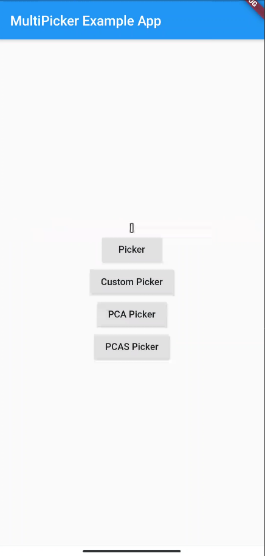
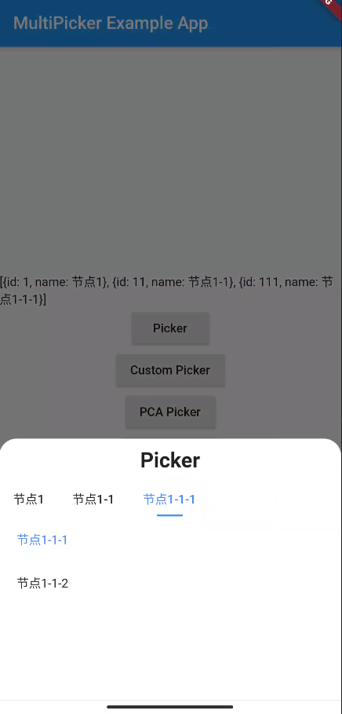
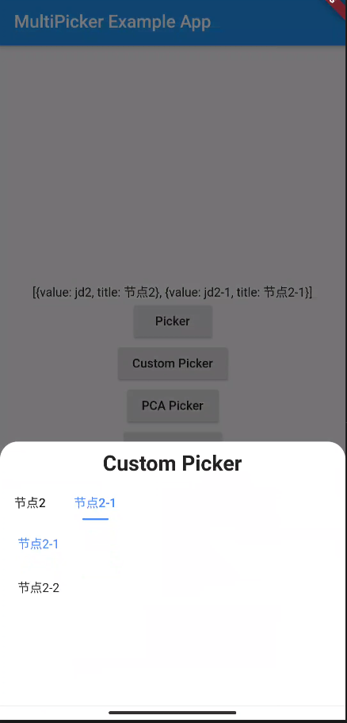
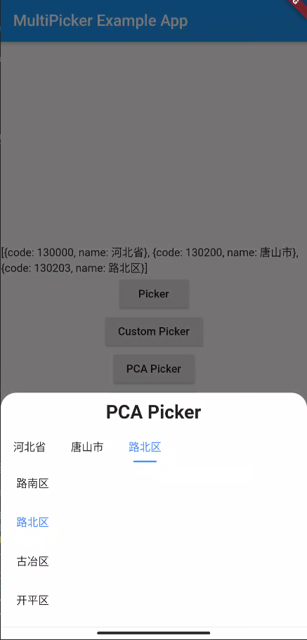
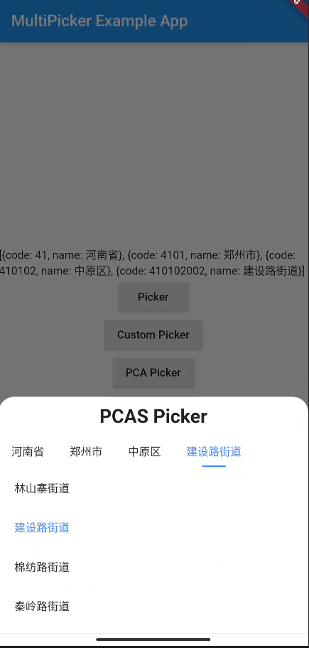

# flutter_multi_picker

Flutter plugin picker. Similar to JD(京东). Provide flexible parameters to meet various needs.
实现类似京东地址选择器的效果

## Getting Started
### 1. Add library to your pubspec.yaml
latest version: [](https://pub.dev/packages/flutter_multi_picker)
```
dependencies:
  flutter_multi_picker: any
```

### 2. Import library in dart file
```
import 'package:flutter_multi_picker/flutter_multi_picker.dart';
```

## Screenshot




